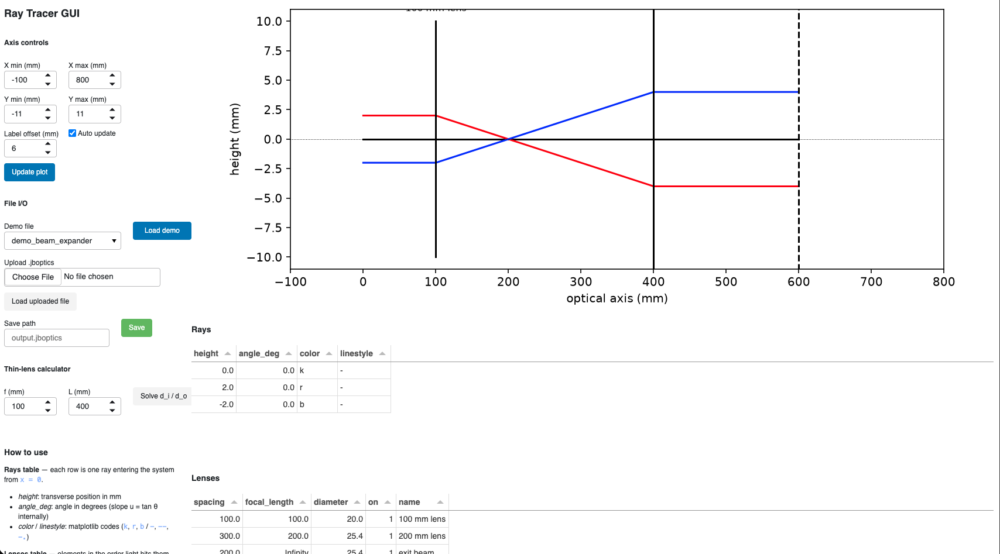
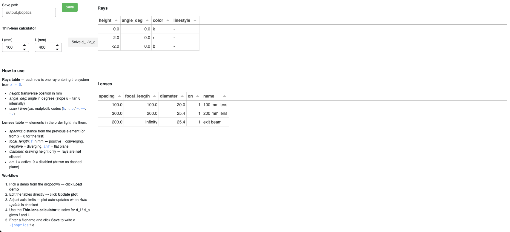

# ray-tracer-gui

A Python package for simple 2-D **paraxial ray tracing** through a sequence of thin lenses and
planes along an optical axis. It is a translation and extension of a MATLAB ray-tracing GUI
originally developed by **Jonny Beaumariage** in the **Dutt Group** at the University of Pittsburgh.

## Features

- Paraxial propagate-then-refract engine (`y, u = tan θ` state variables)
- Thin lenses, flat planes (`f = ∞`), and toggleable on/off elements
- Thin-lens equation solver for `f`, `d_i`, `d_o`, `L`
- Load/save `.jboptics` config files (MATLAB-compatible `.mat` format)
- matplotlib ray/lens plotting with zoom-in legend
- Interactive browser-based GUI via [Panel](https://panel.holoviz.org/)

## Installation

```bash
python3 -m venv .venv
source .venv/bin/activate
pip install -e ".[dev,app]"
```

## Running tests

```bash
.venv/bin/python -m pytest tests/ -v
```

## Screenshots



*Beam expander demo: two converging lenses followed by a flat exit plane. The sidebar shows axis
controls, demo file selector, file I/O, and the thin-lens calculator.*



*Editable ray and lens tables. Each row can be modified directly in the browser; clicking
**Update plot** or adjusting axis limits regenerates the ray diagram immediately.*

## Running the GUI

```bash
.venv/bin/panel serve app/dashboard.py --show --port 5007
```

Opens at `http://localhost:5007/dashboard` by default.

## Physics

The paraxial recurrence for each element `j` (spacing `d_j`, focal length `f_j`):

```
y_{j+1} = y_j + u_j · d_j      # free-space propagation
u_{j+1} = u_j − y_{j+1} / f_j  # thin-lens refraction kick
```

where `u = tan(θ)` is the ray slope. Flat planes have `f = ∞` (refraction term vanishes). All
positions and heights are in **millimetres**; user-facing angles are in **degrees**, converted to
slopes internally.

## Repository layout

```
src/raytracergui/   ← importable package (physics library, UI-agnostic)
app/                ← Panel GUI (browser-based)
tests/              ← pytest test suite
demo_optics_files/  ← .jboptics demo configurations
scripts/            ← standalone run/comparison scripts
notebooks/          ← Jupyter exploration notebooks
matlab-ray-tracer-gui/ ← original MATLAB source (read-only reference)
```

## Acknowledgements

The paraxial ray-tracing engine, lens-system data structures, and interactive layout in
`ray-tracer-gui` are a Python translation and extension of a MATLAB ray-tracing GUI originally
developed by **Jonny Beaumariage** in the **Dutt Group** (Department of Physics and Astronomy,
University of Pittsburgh). The propagate-then-refract paraxial engine and the `.jboptics`
configuration format derive directly from that work. Gurudev Dutt architected the Python port of
ray-tracer-gui — the module structure, paraxial-tracing API, and test strategy — and implemented
it using Claude Code, working from the original MATLAB GUI by Jonny Beaumariage.

If you use `ray-tracer-gui` in published research, please consider acknowledging the original
MATLAB codebase and its author.

## License

MIT
